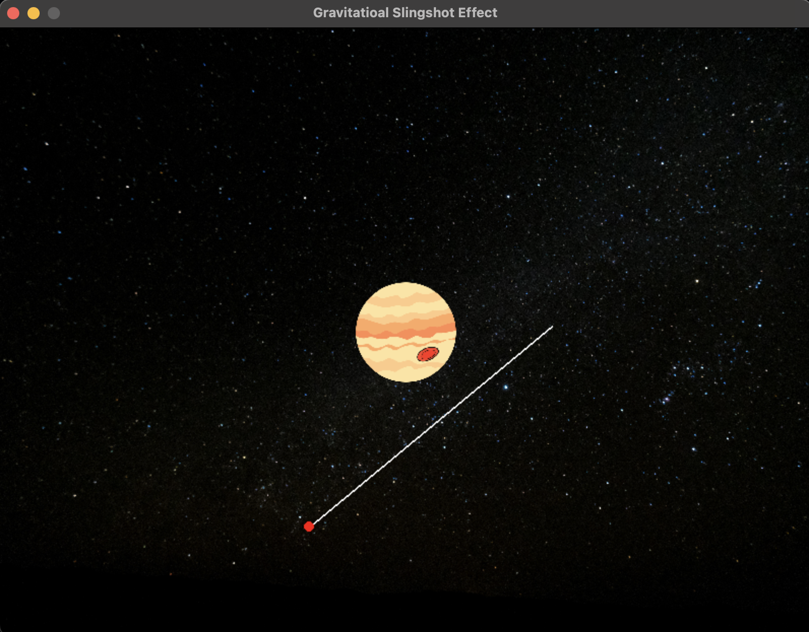

# Gravitational Slingshot Effect

This project simulates the **gravitational slingshot effect** using Pygame. You can launch a spacecraft by clicking and dragging the mouse to provide direction and momentum. The simulation demonstrates how objects interact with the gravitational pull of a planet, showing orbital mechanics and gravitational acceleration in a fun and visual way.

## Features
- A central planet with a gravitational field.
- Ability to launch objects (spacecraft) with momentum determined by mouse drag.
- Real-time physics calculations including:
  - Gravitational acceleration.
  - Object trajectory updates.
  - Collision detection with the planet.
- Interactive graphics and animations.

## How to Play
1. Click anywhere on the screen to set the starting position of the spacecraft.
2. Drag the mouse to adjust the initial velocity vector (direction and speed).
3. Release the mouse button to launch the spacecraft.
4. Watch how the spacecraft reacts to the gravitational pull of the planet.

Spacecrafts can:
- Escape into space.
- Get pulled into orbit.
- Collide with the planet.

## Controls
- **Left Mouse Button:**
  - First click sets the spacecraft's initial position.
  - Drag the mouse to determine the direction and speed.
  - Release to launch the spacecraft.
- **ESC / Close Button:** Exit the game.

## Requirements
- Python 3.x
- Pygame library

## Installation
1. Install Python 3.x from [python.org](https://www.python.org/).
2. Install Pygame using pip:
   ```bash
   pip install pygame
   ```
3. Download or clone this repository.
4. Ensure the required image assets (`background.jpg` and `jupiter.png`) are in the same directory as the script.

## Running the Game
Run the script using Python:
```bash
python gravitational_slingshot.py
```

## Files
- `gravitational_slingshot.py`: The main game script.
- `background.jpg`: Background image for the game.
- `jupiter.png`: Image of the planet used in the simulation.

## Code Explanation
### Key Components
1. **Planet Class**:
   - Represents the central planet.
   - Handles drawing the planet on the screen.

2. **Spacecraft Class**:
   - Represents the spacecraft objects.
   - Handles motion, physics calculations, and drawing.

3. **Physics**:
   - Gravitational force is calculated based on the distance between the planet and the spacecraft using Newton's law of gravitation:
     
     ```
     force = (G * mass_of_planet * mass_of_spacecraft) / distance^2
     ```
   - The force is decomposed into x and y components for motion.

4. **User Interaction**:
   - Mouse events determine the initial position and velocity of the spacecraft.

### Game Loop
- Handles events, updates object positions, checks for collisions, and redraws the screen.
- Removes objects that go off-screen or collide with the planet.

## Improvements and Future Enhancements
- Add multiple planets with independent gravitational fields.
- Introduce different types of spacecraft with unique properties (e.g., mass, size).
- Include visual trails to show the path of launched objects.
- Add sound effects for collisions and launches.

## Acknowledgments
This project was created to visualize the concept of gravitational slingshot effects in a simple and interactive manner using Python and Pygame.

## License
This project is open-source and available under the MIT License.

## Outputs:-

